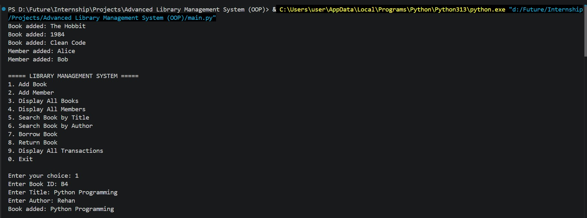
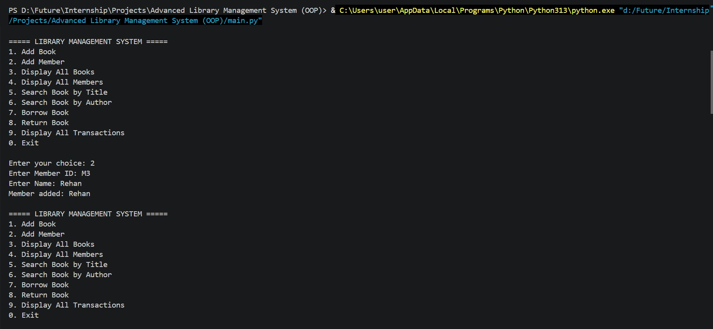
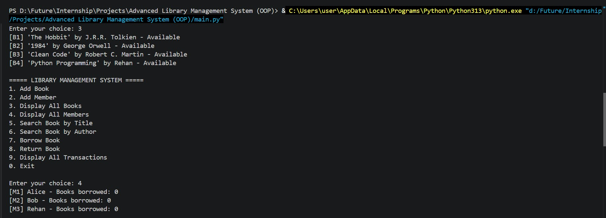
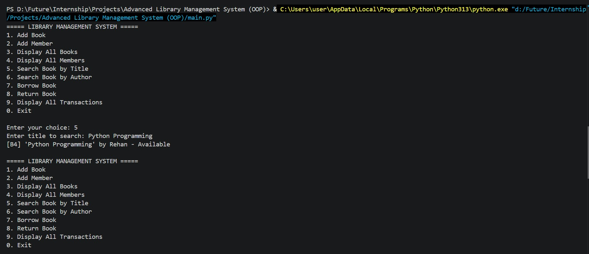
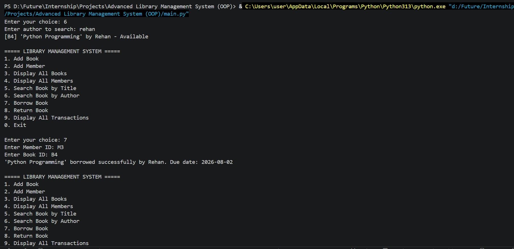
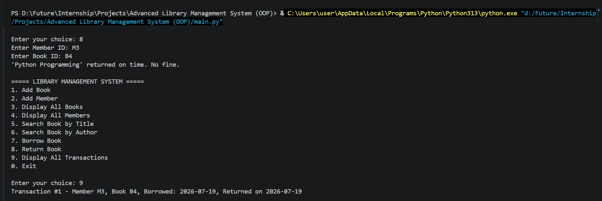
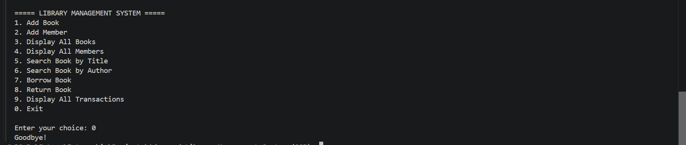

# Advanced Library Management System (OOP)

A Python-based library management system built using Object-Oriented Programming principles. This system allows users to manage books, members, and track borrowing transactions in a library environment.

## Demo Video
<video src="https://github.com/user-attachments/assets/f120719a-5d2c-4d10-b4de-073f9af60ee4" controls width="600"></video>

## Screenshots
1.


2.


3.


4.


5.


6.


7.


## Features

- **Book Management**: Add, display, and search books by title or author
- **Member Management**: Register and manage library members
- **Borrowing System**: Borrow and return books with a 14-day lending period
- **Transaction Tracking**: Maintain a complete history of all borrowing transactions
- **Fine Calculation**: Automatic calculation of late fees for overdue books
- **Search Functionality**: Find books by title or author name
- **Interactive CLI**: User-friendly command-line interface with a menu-driven system

## Project Structure

```
Advanced Library Management System (OOP)/
│
├── book.py              # Book class - manages book properties and status
├── member.py            # Member class - manages member information
├── library.py           # Library class - core management system
├── transaction.py       # Transaction class - tracks borrow/return history
├── main.py              # Main entry point with CLI menu
└── README.md            # This file
```

## Class Descriptions

### Book (`book.py`)
- **Attributes**: `book_id`, `title`, `author`, `is_borrowed`, `borrowed_by`, `due_date`
- **Methods**: 
  - `get_details()`: Returns formatted book information
  - `mark_borrowed()`: Marks a book as borrowed
  - `mark_returned()`: Marks a book as available

### Member (`member.py`)
- **Attributes**: `member_id`, `name`, `borrowed_books`
- **Methods**:
  - `get_details()`: Returns member information
  - `borrow_book()`: Adds a book to borrowed list
  - `return_book()`: Removes a book from borrowed list
  - `get_borrowed_count()`: Returns count of borrowed books

### Library (`library.py`)
- **Attributes**: `books`, `members`, `transactions`, `next_transaction_id`
- **Methods**:
  - `add_book()`: Add a new book to the library
  - `add_member()`: Register a new member
  - `search_book_by_title()`: Search books by title
  - `search_book_by_author()`: Search books by author
  - `borrow_book()`: Process book borrowing
  - `return_book()`: Process book return
  - `display_all_books()`: List all books
  - `display_all_members()`: List all members
  - `display_all_transactions()`: Show transaction history

### Transaction (`transaction.py`)
- **Attributes**: `transaction_id`, `member_id`, `book_id`, `borrow_date`, `return_date`, `fine`
- **Methods**:
  - `get_details()`: Returns formatted transaction information
  - `mark_returned()`: Records return date and calculates fine

## Installation

### Prerequisites
- Python 3.6 or higher

### Setup
1. Clone or download this project
2. Navigate to the project directory:
   ```bash
   cd "Advanced Library Management System (OOP)"
   ```

## Usage

### Running the System
Execute the main program:
```bash
python main.py
```

### Menu Options

The interactive menu provides the following options:

1. **Add Book** - Add a new book to the library
2. **Add Member** - Register a new library member
3. **Display All Books** - View all books in the library
4. **Display All Members** - View all registered members
5. **Search Book by Title** - Find books by title (partial matches supported)
6. **Search Book by Author** - Find books by author (partial matches supported)
7. **Borrow Book** - Member borrows a book (14-day lending period)
8. **Return Book** - Member returns a borrowed book
9. **Display All Transactions** - View complete transaction history
10. **Exit** - Close the application

### Example Workflow

```
1. Add a book: Choose option 1 and enter book details
2. Register a member: Choose option 2 and enter member details
3. Borrow a book: Choose option 7, enter member ID and book ID
4. Return a book: Choose option 8, enter member ID and book ID
5. View transactions: Choose option 9 to see all activity
```

## Configuration

Key system constants (in `library.py`):
- **BORROW_PERIOD_DAYS**: 14 (number of days before a book is due)
- **FINE_PER_DAY**: 1.0 (fine amount in currency units per day for overdue books)

## Features Explanation

### Borrow System
- Members can borrow books that are marked as "Available"
- Books are marked as "Borrowed" when taken out
- The due date is automatically calculated as 14 days from the borrow date
- Only available books can be borrowed

### Fine Calculation
- Late fees are calculated based on days overdue
- Fine amount per day is configurable via `FINE_PER_DAY` constant
- Fines are calculated when books are returned past the due date

### Search Functionality
- Searches are case-insensitive
- Partial matches are supported (e.g., searching "Hobbit" will find "The Hobbit")

## Data Persistence

**Note**: Currently, the system stores data in memory only. To add persistent storage, consider:
- Implementing file I/O (JSON, CSV, or pickle)
- Integrating a database (SQLite, MySQL, PostgreSQL)

## Future Enhancements

- [ ] Database integration for persistent storage
- [ ] User authentication and role management
- [ ] Advanced search filters
- [ ] Reservation system for borrowed books
- [ ] Report generation (overdue books, member activity)
- [ ] Renewal of book borrowing period
- [ ] GUI interface using tkinter or PyQt

## Learning Outcomes

This project demonstrates:
- Object-Oriented Programming principles (encapsulation, abstraction)
- Class design and relationships
- List operations and data management
- Date/time handling
- String manipulation and searching
- Menu-driven CLI application development

## License

This is an educational project for learning OOP concepts in Python.

## Author

Created as part of an internship project in Advanced Library Management System development.
