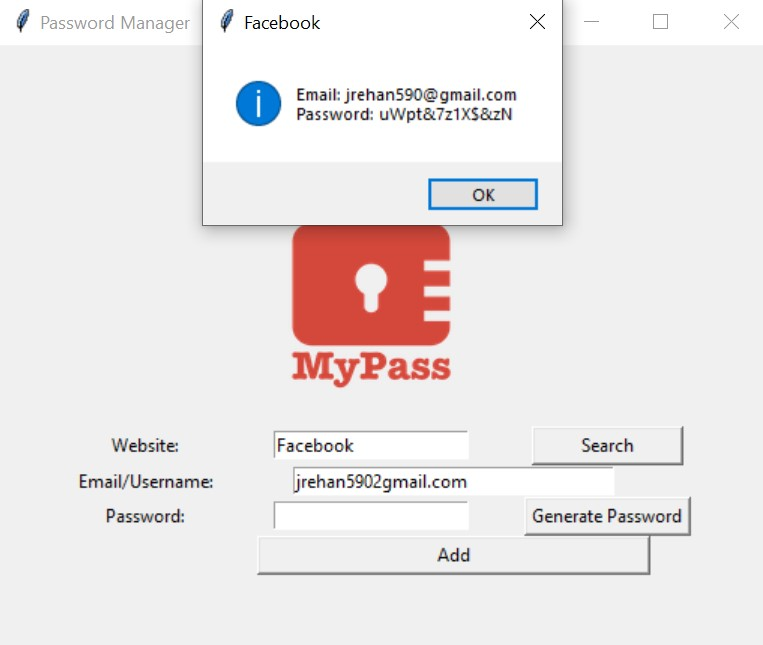
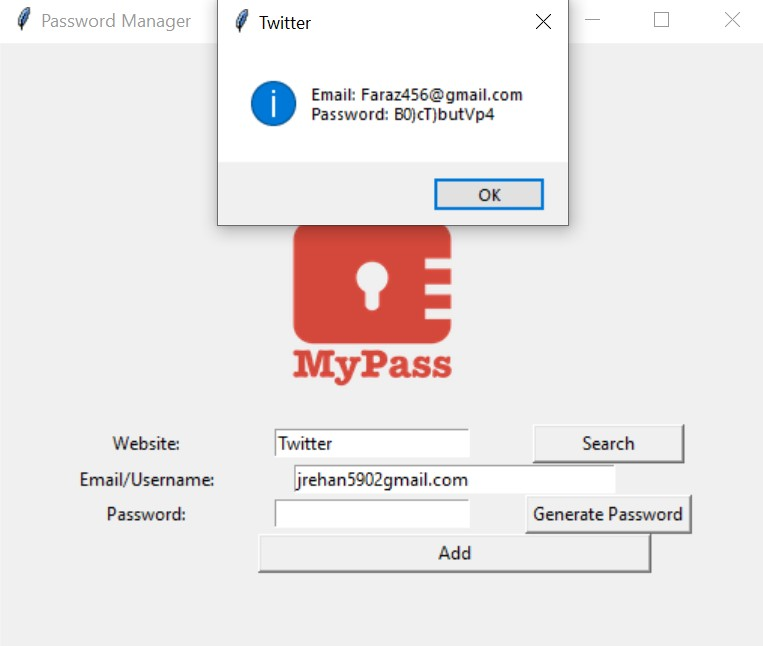

# Advanced Password Manager

A simple yet powerful GUI-based password manager built with Python. Generate secure passwords, store them safely, and retrieve your credentials whenever you need them.

## Demo Video
<video src="https://github.com/user-attachments/assets/14ce4c80-cf03-4498-9e3c-f885ff4924ae" controls width="600"></video>

## 1
   

## 2
   

## Data File 
   

## Features

- 🔐 **Password Generation**: Generate strong, random passwords with a mix of uppercase, lowercase, numbers, and special characters
- 💾 **Secure Storage**: Save your website credentials (website, email/username, and password) in a local JSON file
- 🔍 **Quick Lookup**: Retrieve stored credentials for any website instantly
- 📋 **Auto Copy**: Automatically copies generated passwords to your clipboard
- 🎨 **User-Friendly GUI**: Clean and intuitive interface built with Tkinter

## Project Structure

```
Advanced Password Manager/
├── main.py           # Main application file with all functionality
├── data.json         # Local database storing encrypted credentials
├── logo.png          # Application logo (required)
├── pyproject.toml    # Project configuration and dependencies
└── README.md         # This file
```

## Requirements

- Python 3.8 or higher
- tkinter (usually comes with Python)
- pyperclip

## Installation

### 1. Clone or Download the Project
```bash
cd "Advanced Password Manager"
```

### 2. Install Dependencies

Using Poetry:
```bash
poetry install
```

Or using pip:
```bash
pip install pyperclip
```

### 3. Add Logo Image
Place a `logo.png` file (200x200 pixels recommended) in the project directory.

## Usage

### Running the Application
```bash
python main.py
```

### How to Use

1. **Generate a Password**
   - Click the "Generate Password" button
   - A random password will be generated and automatically copied to your clipboard

2. **Save Credentials**
   - Enter the website name (e.g., "Facebook", "Gmail")
   - Enter your email or username
   - Enter your password (or generate one)
   - Click "Save" to store the credentials
   - Your data is saved in `data.json`

3. **Retrieve Credentials**
   - Enter the website name
   - Click "Search"
   - Your saved email and password will be displayed in a popup

## Data Storage

Credentials are stored locally in `data.json` with the following format:

```json
{
    "Facebook": {
        "email": "your-email@example.com",
        "password": "your-password"
    },
    "Gmail": {
        "email": "your-email@gmail.com",
        "password": "your-password"
    }
}
```

**Note**: This application stores passwords in plain text. For production use, consider implementing encryption.

## Security Considerations

⚠️ **Important**: This application stores passwords in plain text for educational purposes. For real-world use:
- Implement encryption for stored passwords
- Use environment variables for sensitive data
- Consider using established password management libraries
- Never commit `data.json` to version control

## Dependencies

| Package | Version | Purpose |
|---------|---------|---------|
| pyperclip | ^1.8.0 | Copy generated passwords to clipboard |
| tkinter | Built-in | GUI framework |

## GUI Components

- **Canvas**: Displays the application logo
- **Entry Fields**: 
  - Website input
  - Email/Username input
  - Password input
- **Buttons**:
  - Generate Password
  - Save
  - Search

## Troubleshooting

### "No Data File Found" Error
- This occurs on first use. Simply add your first entry, and `data.json` will be created automatically.

### Logo Image Not Found
- Ensure `logo.png` is in the same directory as `main.py`
- The image should be 200x200 pixels

### Clipboard Issues
- Some systems may have clipboard restrictions. Ensure `pyperclip` is installed correctly.

## Future Enhancements

- 🔒 Password encryption for stored data
- 🎯 Master password protection
- 📱 Database export/import functionality
- 🌐 Support for multiple password vaults
- 🔄 Password strength indicator
- 🗑️ Delete/Edit stored passwords

## Contributing

Feel free to fork this project and submit pull requests for improvements!

## License

This project is open source and available for educational purposes.

## Author

Created as an internship project to demonstrate Python GUI development and credential management concepts.

---

**Disclaimer**: Use this application responsibly. Always backup your `data.json` file. This application is for educational purposes and not recommended for storing real passwords without implementing proper encryption.
