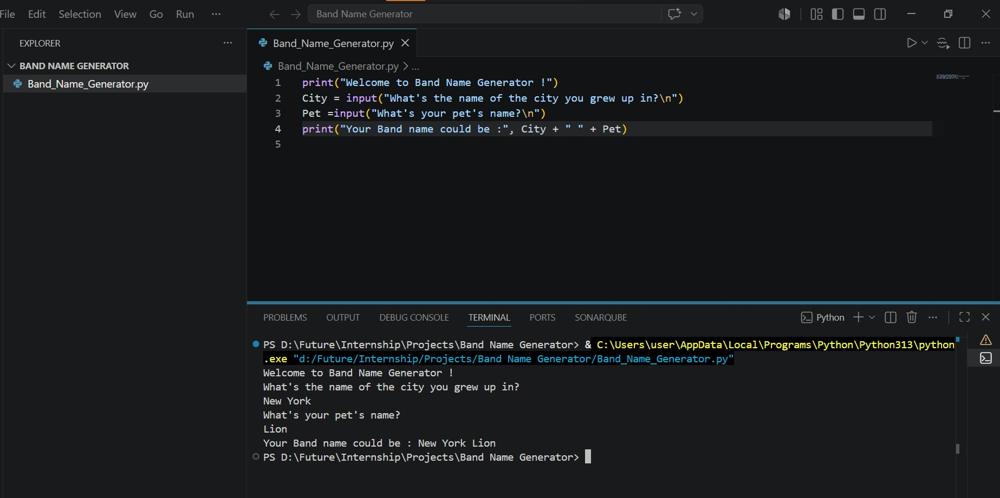

# Band Name Generator

A simple and interactive command-line Python script that generates a unique band name based on user inputs.

## Screenshot
## Band-Name-Generator


## Description

The **Band Name Generator** is a beginner-friendly Python program that helps you brainstorm band names. It prompts the user for two inputs:
1. The city they grew up in.
2. The name of their pet.

It then combines these inputs to suggest a creative and memorable band name.

## Features

- Simple and intuitive command-line interface.
- Interactive user prompts.
- Instant band name suggestions.

## Prerequisites

To run this project, you need to have Python installed on your system. You can download it from [python.org](https://www.python.org/).

- Python 3.x (recommended)

## How to Run

1. Open your terminal or command prompt.
2. Navigate to the project directory.
3. Run the script using Python:
   ```bash
   python Band_Name_Generator.py
   ```

## Example Interaction

```text
Welcome to Band Name Generator !
What's the name of the city you grew up in?
Bristol
What's your pet's name?
Max
Your Band name could be : Bristol Max
```
