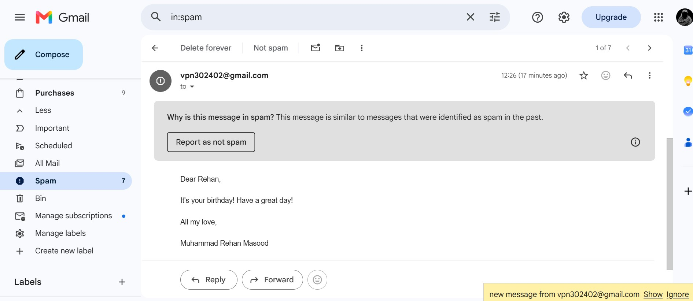

# Birthday Wisher

A small Python utility that sends personalized birthday emails using a CSV of birthdays and letter templates.

## Demo Video
<video src="https://github.com/user-attachments/assets/bd9d99a5-43d7-49d1-aefb-ff80a01ce5c3" controls width="600"></video>

## Gmail-Received-Confrimation
   

**Project files:**
- [main.py](main.py): program entry point — finds today's birthdays and sends emails using `credentials.py`.
- [birthdays.csv](birthdays.csv): CSV with birthday records (required columns described below).
- [credentials_example.py](credentials_example.py): example credentials file — copy to [credentials.py](credentials.py) and fill in your settings.
- [letter_templates/letter_1.txt](letter_templates/letter_1.txt), [letter_templates/letter_2.txt](letter_templates/letter_2.txt), [letter_templates/letter_3.txt](letter_templates/letter_3.txt): message templates used to generate personalized letters.

## Requirements
- Python 3.8+
- No external packages required (uses the standard library: `smtplib`, `datetime`, `random`, etc.).

## Setup

1. Make a copy of `credentials_example.py` and name it `credentials.py`:

```powershell
cp credentials_example.py credentials.py
```

2. Edit `credentials.py` and fill in your email configuration (SMTP server, port, login, and password/app-password).

3. Prepare `birthdays.csv` with these columns (header required):

```
name,email,year,month,day
```

Example row:

```
Rehan,jrehan590@gmail.com,2003,07,29
```

4. Customize or add message templates in the `letter_templates/` folder. Templates can contain the placeholder `[NAME]` which will be replaced by the recipient's name.

## Usage

Run the script to send birthday emails for entries that match today's month and day:

```powershell
python main.py
```

Notes:
- Test with a dummy account or change `credentials.py` to point to a test SMTP server before sending to real recipients.
- Gmail users may need an app password and to allow SMTP access for the sending account.

## How it works (brief)
- On each run, `main.py` reads `birthdays.csv`, checks for rows whose `month` and `day` match today's date, randomly picks a template from `letter_templates/`, replaces `[NAME]` with the recipient's name, and sends the message using credentials in `credentials.py`.

## Contributing
Feel free to open issues or submit pull requests to add features (scheduling, logging, support for HTML emails, batch-sending throttling, etc.).

## License
This project is provided as-is; adapt and reuse as you need.
