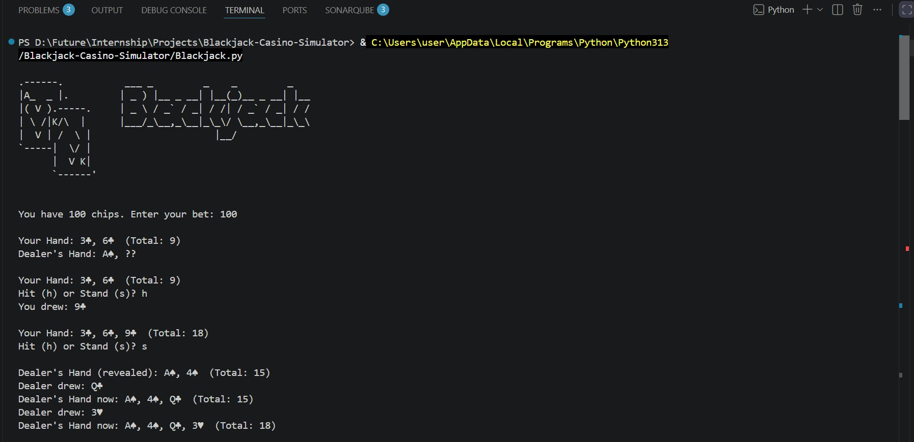
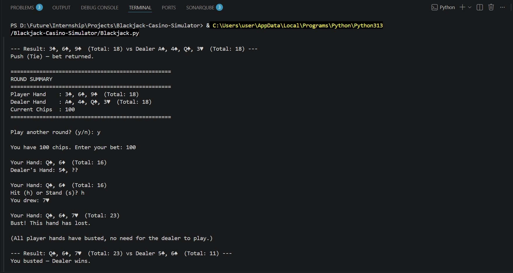
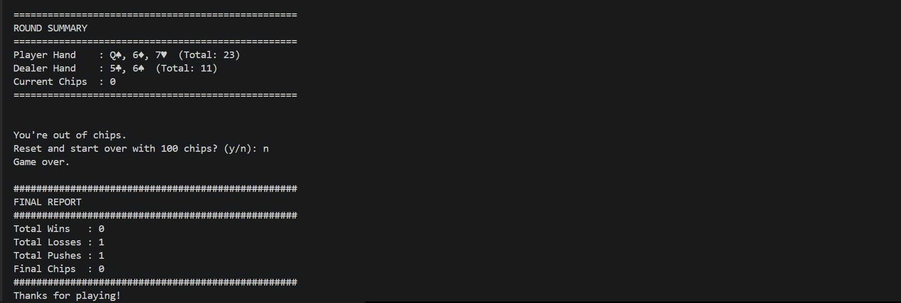

# Blackjack Casino Simulator

A terminal-based Blackjack (21) game built entirely with Object-Oriented Programming in Python. The Player bets chips and plays against the Dealer (computer), following standard Blackjack rules.

## Screenshot
## 1.
   

## 2.
   

## 3.
   
## Overview

- Player places a bet from their chip balance.
- Player chooses to Hit (take a card) or Stand (stop) on each turn.
- Dealer automatically draws cards until reaching 17 or higher.
- Whoever is closest to 21 without going over (busting) wins the round.

## Project Structure

The game is built using four main classes plus a class that controls the overall game flow.

| Class            | Responsibility                                                  |
|------------------|------------------------------------------------------------------|
| `Card`           | Stores a suit and rank, and returns the card's point value       |
| `Deck`           | Builds a 52-card deck, shuffles it, and deals cards               |
| `Hand`           | Holds a list of cards and calculates the hand's total value       |
| `Chips`          | Tracks the player's balance: betting, winning, losing, save/load  |
| `BlackjackGame`  | Runs the full game loop: bets, dealing, hit/stand, dealer turn, results |

## Features

- Four core classes with clear, single responsibilities
- Ace handling: an Ace counts as 11, but automatically switches to 1 if the hand would otherwise bust
- Safe input handling: entering text instead of a number does not crash the program
- Hit / Stand gameplay loop
- Dealer logic: draws below 17, stands at 17 or higher
- Split option: if the first two cards match, the player can split them into two separate hands
- Persistent chips: the balance is saved to `chips.txt` and reloaded automatically the next time the game runs
- Chips reset option if the player runs out of chips
- Round summary printed after every round (hands and current chips)
- Final report of total wins, losses, and pushes when the game ends

## How to Run

Requires Python 3.

```bash
python3 blackjack_casino.py
```

## Files

| File                  | Description                                  |
|-----------------------|-----------------------------------------------|
| `blackjack_casino.py` | Main game source code                        |
| `chips.txt`           | Auto-generated file that stores chip balance |

## Notes

- No nested dictionaries or plain lists are used to represent game entities — all game state is modeled through classes and objects.
- `chips.txt` is created automatically the first time the game is run and updated after every round.
