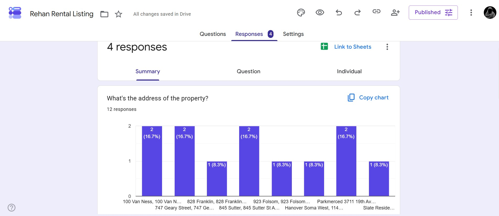

# Data Entry Job Automation

A small automation script that scrapes property listings from a Zillow-like demo site and submits them into a Google Form using Selenium.

## Demo Video
<video src="https://github.com/user-attachments/assets/c2997cfe-a672-486f-a70b-29c3f16f6cc8" controls width="600"></video>

## Data-Entry-Job-Automation
   

## Google-Reponse-Chart
   

   
## What it does
- Scrapes property addresses, prices, and links from a Zillow clone demo page.
- Automatically fills and submits a Google Form for each listing.

## Requirements
- Python 3.8+
- Google Chrome installed (or change to another webdriver)
- Python packages:
  - requests
  - beautifulsoup4
  - selenium
  - webdriver-manager

Install dependencies with:

```bash
pip install requests beautifulsoup4 selenium webdriver-manager
```

## Usage
1. Review and (optionally) update constants in `main.py`:
   - `ZILLOW_CLONE_URL` — source page to scrape
   - `GOOGLE_FORM_URL` — target Google Form to submit
   - `MAX_LISTINGS` — how many listings to process

2. Run the script:

```bash
python main.py
```

The script will open a Chrome window, scrape the demo site, and submit each listing into the configured Google Form.

## Notes
- `webdriver_manager` automatically installs a compatible ChromeDriver, but Chrome must be present on your machine.
- The Google Form XPaths and input selectors assume the form structure used in the demo; if the Form changes, you may need to update the selectors in `fill_google_form()`.
- Use responsibly — automated submissions to third-party forms may violate terms of service.

## Files
- [main.py](main.py) — main automation script.

## License
MIT
