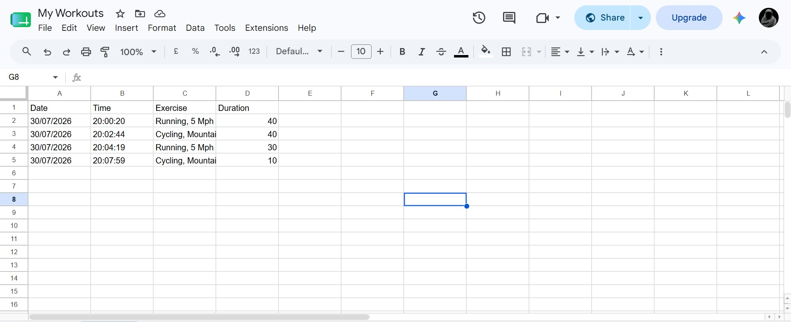

# Workout Tracker

A small exercise tracking helper that uses the API Ninjas "caloriesburned" endpoint and Sheety to log workouts into a Google Sheet.

## Demo Video
<video src="https://github.com/user-attachments/assets/592a7147-d443-4525-a8d6-097875509fe4" controls width="600"></video>

## SpreadSheet
   

This repository contains a minimal runnable example (`main.py`) that queries the calorie estimation API and sends a single row to a Sheety endpoint. The example currently contains placeholder/hard-coded credentials — do NOT commit real API keys. Instead, set the values below as environment variables.

**Contents**
- Description
- Requirements
- Environment variables
- Run
- Notes & FAQs

## Description

The script asks for a short free-text description of your exercise (for example: "running", "cycling") and a duration in minutes. It sends that to API Ninjas to get a parsed exercise entry and estimated calories burned, then posts the result to a Sheety endpoint which writes a row to a Google Sheet.

## Requirements

- Python 3.8 or newer
- `requests` library

Install the dependency:

```bash
pip install requests
```

## Environment variables

Set the following environment variables before running the script. Example names used in the code:

- `NINJA_API_KEY` — API Ninjas key for the `caloriesburned` endpoint
- `SHEET_ENDPOINT` — full Sheety API URL for your sheet (the API endpoint created by Sheety)
- `SHEETY_USERNAME` — username for basic auth to Sheety (if you use basic auth)
- `SHEETY_PASSWORD` — password for Sheety basic auth
- `WEIGHT_KG` (optional) — your weight in kilograms; the script uses this to estimate calories

Example (PowerShell):

```powershell
$env:NINJA_API_KEY = "your_api_ninja_key"
$env:SHEET_ENDPOINT = "https://api.sheety.co/your_project/yourSheet/sheet1"
$env:SHEETY_USERNAME = "your_username"
$env:SHEETY_PASSWORD = "your_password"
python main.py
```

Example (bash):

```bash
export NINJA_API_KEY=your_api_ninja_key
export SHEET_ENDPOINT="https://api.sheety.co/your_project/yourSheet/sheet1"
export SHEETY_USERNAME=your_username
export SHEETY_PASSWORD=your_password
python main.py
```

Notes: the example `main.py` in this repo currently uses hard-coded values for these variables — updating the script to read from `os.environ` is recommended for safety.

## Run

Run the script and follow the prompts:

```bash
python main.py
```

You will be prompted for the exercise description and duration. The script prints the API response and the Sheety response.

## Notes & FAQs

- Do not commit real API keys. Use environment variables or a secrets manager.
- If you see a `KeyError` when using `os.environ[...]`, switch to `os.getenv('NAME')` and add a helpful error when missing.
- Sheety permissions: ensure Sheety has access to the Google Sheet and the correct resource names (see Sheety docs). If you get authorization/permission errors, re-check the OAuth/Sheety setup.

If you'd like, I can update `main.py` to read credentials from environment variables and remove the hard-coded secrets. Want me to do that?
