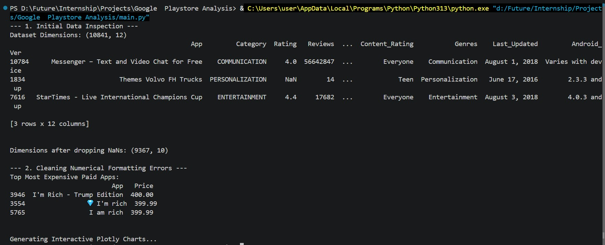

# Google Play Store Analysis

This project analyzes a Google Play Store dataset and generates a few quick insights with Python. The main script loads `apps.csv`, cleans a couple of numeric fields, prints summary checks to the console, and opens interactive Plotly charts.

## Demo Video
<video src="https://github.com/user-attachments/assets/280217c4-0655-4671-b6e1-0e9a2d287f8f" controls width="600"></video>

## Google Play Store Analysis
   

## What it does

- Loads the app dataset from `apps.csv`
- Drops unused columns and missing values
- Cleans `Installs` and `Price` so they can be analyzed numerically
- Summarizes apps by category
- Displays interactive visualizations with Plotly

## Project Files

- `main.py` - analysis and visualization script
- `apps.csv` - dataset used by the script
- `requirements.txt` - Python dependencies

## Requirements

- Python 3.9 or later is recommended
- Install the dependencies listed in `requirements.txt`

## Installation

```bash
pip install -r requirements.txt
```

## Usage

Run the main script from the project folder:

```bash
python main.py
```

## Output

When the script runs, it prints:

- dataset dimensions and sample rows
- dimensions after cleaning
- the most expensive paid apps

It also opens two interactive charts:

- a bar chart showing the number of apps in each category
- a bubble chart comparing app volume and total installs by category

## Notes

- The script expects `apps.csv` to be in the same folder as `main.py`
- Plotly visualizations open in your default browser or notebook renderer depending on your environment
