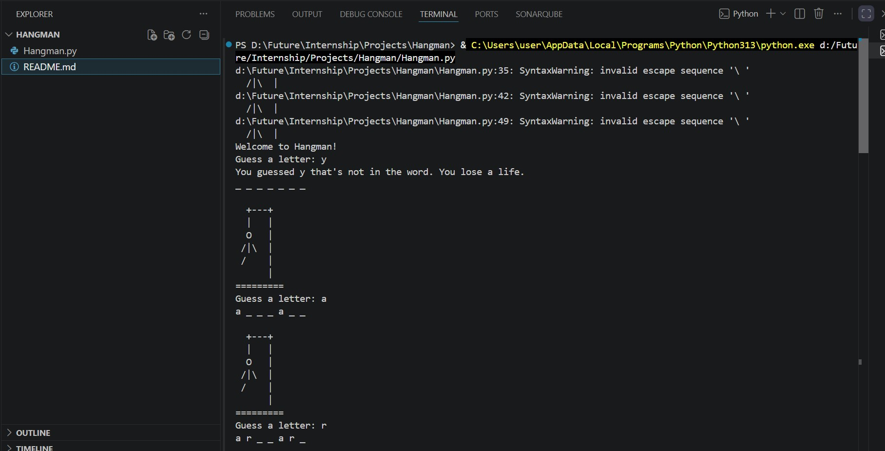

# Hangman Game

A classic command-line Hangman game implemented in Python. The game selects a random word from a predefined list, and the player has to guess it letter by letter before running out of lives.

# Screenshot
## 1.
   

## Features

- **Random Word Selection**: Chooses a random word from a built-in dictionary for each game.
- **Visual ASCII Art**: Displays the hangman status dynamically using ASCII art for every incorrect guess.
- **Input Validation**: Keeps track of guessed letters and notifies the player if they guess the same letter twice.
- **Interactive Feedback**: Shows the current progress of the word with blanks (e.g., `_ _ _ _ _`) and reveals the correct letters as you guess.

## Prerequisites

To run this game, you only need Python installed on your system:
- **Python 3.x**

## How to Run

1. Clone or download this repository.
2. Navigate to the project directory in your terminal:
   ```bash
   cd Hangman
   ```
3. Run the Python script:
   ```bash
   python Hangman.py
   ```

## Gameplay Instructions

1. Upon starting, the game greets you and displays blank spaces corresponding to the length of the chosen word.
2. You will be prompted to: `Guess a letter: `.
3. Type a letter and press **Enter**:
   - **Correct Guess**: The letter fills in its position(s) in the word.
   - **Incorrect Guess**: You lose one of your 6 lives, and a segment of the hangman ASCII art is drawn.
   - **Duplicate Guess**: You will be alerted that you've already guessed that letter.
4. You win if you guess all the letters in the word.
5. You lose if the hangman is fully drawn (6 incorrect guesses).

## Project Structure

- `Hangman.py`: The main game logic containing word lists, stages, and the main game loop.
