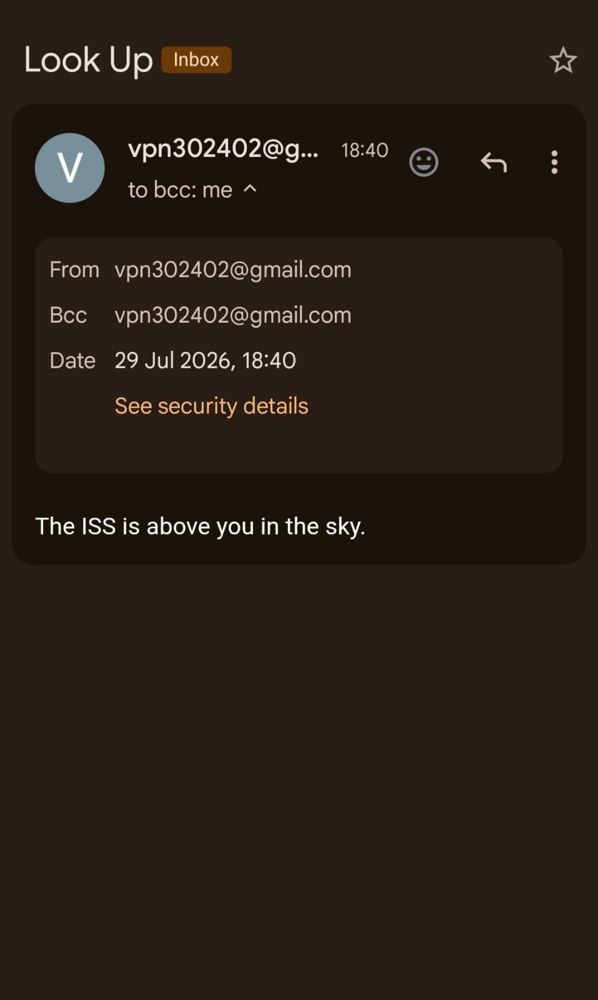

# ISS Overhead Notifier Project

A small Python script that checks the current position of the International Space Station (ISS) and sends an email notification when the ISS is overhead at night.

## Testing Gmail Demo Video
<video src="https://github.com/user-attachments/assets/19920d10-2261-4bee-b4ba-dfb762aee341" controls width="600"></video>

## Email-Received-Confirmation
   <p align="center">
  
  </p>

## 60-Sec-Notification-Checking
   


## Overview

- The script polls the Open Notify ISS position API and the Sunrise-Sunset API to determine whether the ISS is within ~5° of the configured location and whether it is currently night there.
- When both conditions are true the script sends a short email notification using SMTP.

The main program entrypoint is [main.py](main.py#L1).

## Prerequisites

- Python 3.8 or newer
- Internet access
- An email account that allows SMTP access (Gmail with an app password is commonly used)
- The `requests` package

Install `requests` if you don't already have it:

```bash
pip install requests
```

## Configuration

By default the script contains constants at the top of `main.py` for:

- email address and password (`MY_EMAIL`, `MY_PASSWORD`) — currently hardcoded in the file
- latitude and longitude (`MY_LAT`, `MY_LONG`)
- `TEST_MODE` (set to `True` to send a single test email)

For safety, remove any hard-coded credentials before committing this project. Prefer one of these approaches:

- Use environment variables and modify `main.py` to read them (recommended).
- Store credentials in a local `.env` file and load them with `python-dotenv`.

Example environment variable usage (PowerShell):

```powershell
$env:MY_EMAIL = "you@example.com"
$env:MY_PASSWORD = "your_app_password"
$env:MY_LAT = "30.309065"
$env:MY_LONG = "71.943004"
python main.py
```

Or on macOS / Linux:

```bash
export MY_EMAIL="you@example.com"
export MY_PASSWORD="your_app_password"
export MY_LAT="30.309065"
export MY_LONG="71.943004"
python main.py
```

## Running

Quick run (edit `main.py` or set environment variables as above):

```bash
python main.py
```

- If `TEST_MODE = True` the script will immediately send one test email and exit (useful to validate SMTP credentials).
- When running normally the script checks every 60 seconds and prints status messages to the console.

## Security & Gmail notes

- Do NOT commit real credentials to version control.
- For Gmail, create an App Password (recommended) and use that as `MY_PASSWORD`. If you rely on legacy "less secure apps", Google may block sign-in.

## Troubleshooting

- If you get SMTP authentication errors, verify the email, password/app-password, and whether the account allows SMTP sign-in.
- If API requests fail, check your network connectivity and whether the APIs are reachable from your location.

## License

This project is provided as-is. Add a license if you plan to share or publish it.
