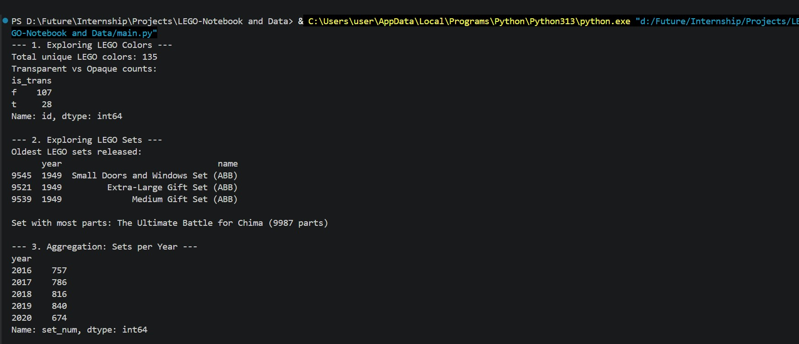
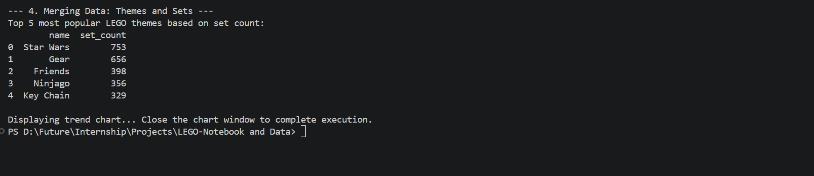

# LEGO Notebook and Data

A small data analysis project that explores LEGO datasets with Python, pandas, and matplotlib. The script reads CSV files about LEGO colors, sets, and themes, then prints summary statistics and shows a trend chart for LEGO production growth over time.

## Demo Video
<video src="https://github.com/user-attachments/assets/cb7283b9-831d-41db-9ae6-a8936e5f7284" controls width="600"></video>

## LEGO-Notebook and Data
   
   
   
## Project Goals

- Explore how many LEGO colors exist and how transparent colors are distributed.
- Identify the oldest LEGO sets and the set with the most parts.
- Compare how many sets and themes LEGO released across different years.
- Find the most popular LEGO themes based on set counts.
- Visualize LEGO production growth with a dual-axis line chart.

## Files

- `main.py` - Runs the analysis from the command line.
- `Lego_Analysis_for_Course_(completed).ipynb` - Notebook version of the analysis.
- `colors.csv` - LEGO color dataset.
- `sets.csv` - LEGO set dataset.
- `themes.csv` - LEGO theme dataset.
- `requirements.txt` - Python dependencies.
- `assets/` - Project assets.

## Requirements

- Python 3.9 or newer is recommended.
- Dependencies listed in `requirements.txt`.

Install them with:

```bash
pip install -r requirements.txt
```

## How To Run

### Run the script

From the project folder, run:

```bash
python main.py
```

The script will print results to the console and open a matplotlib chart. Close the chart window to finish execution.

### Run the notebook

Open `Lego_Analysis_for_Course_(completed).ipynb` in Jupyter Notebook, JupyterLab, or VS Code and run the cells from top to bottom.

## Data Source

This project uses LEGO data files commonly distributed through Rebrickable datasets.

## Output

When you run the script, you should see:

- the total number of unique LEGO colors,
- transparent vs opaque color counts,
- the oldest LEGO sets,
- the set with the most parts,
- sets and themes aggregated by year,
- a chart showing LEGO production trends over time.
