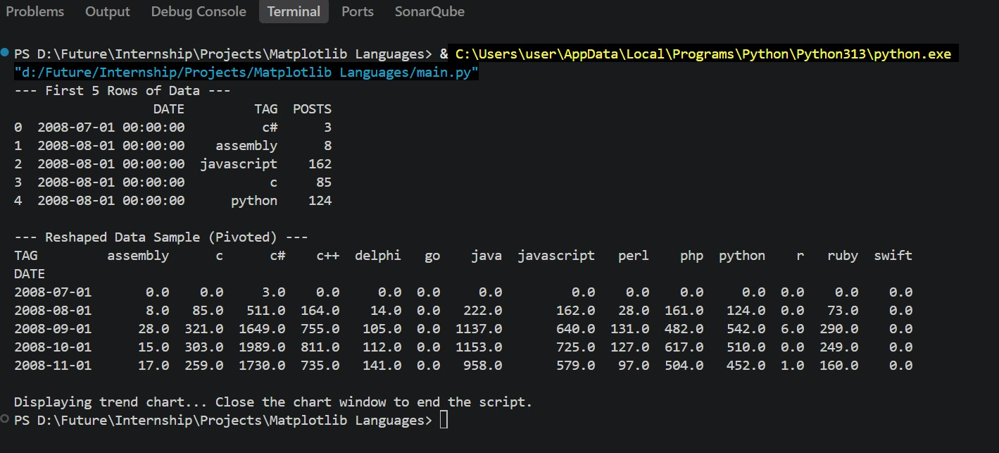

# Matplotlib Languages

This project analyzes and visualizes the popularity of programming languages on Stack Overflow using Python, pandas, and matplotlib.

## Demo Video
<video src="https://github.com/user-attachments/assets/15acabe4-bead-40fa-8881-a89ca1cae444" controls width="600"></video>

## Matplotlib Languages
   

## What the project does

The script:
- reads the dataset from `QueryResults.csv`
- converts the data into a time-based table
- smooths the trend using a rolling average
- plots selected programming languages over time

## Project files

- `main.py` - main Python script that loads the CSV, processes the data, and creates the chart
- `QueryResults.csv` - source dataset containing language-related post counts over time
- `requirements.txt` - required Python packages

## Requirements

Install the dependencies with:

```bash
pip install -r requirements.txt
```

## How to run

Run the script from the project folder:

```bash
python main.py
```

A chart window will open showing the popularity trends for Python, Java, JavaScript, C++, and R.

## Example output

The script prints the first few rows of the dataset and the reshaped table before displaying the chart.
