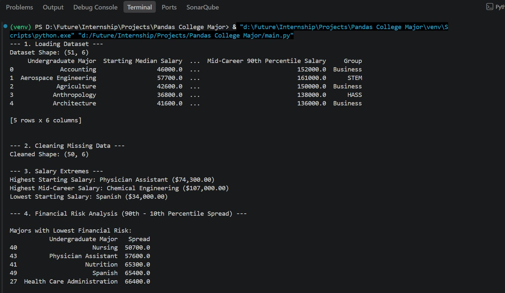
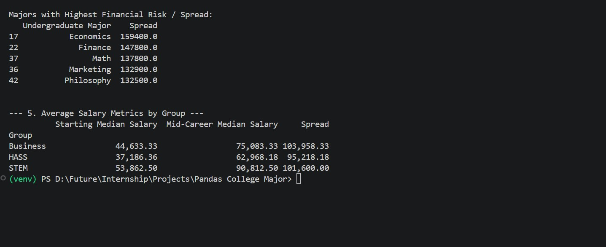

# Pandas College Major Salary Analysis

This project analyzes a dataset of college majors and their salary statistics using Python and Pandas. The script loads the CSV file, cleans missing values, identifies salary extremes, and compares salary spread as a measure of financial risk.

## Demo Video
<video src="https://github.com/user-attachments/assets/f4628c18-190d-43a4-91bb-e888ec37a4af" controls width="600"></video>

## Pandas College Major
   
   

## Project Overview

The analysis includes:
- Loading the dataset from the CSV file
- Removing rows with missing values
- Finding the highest and lowest starting salaries
- Finding the highest and lowest mid-career salaries
- Calculating salary spread between the 90th and 10th percentile values
- Summarizing average salary metrics by group when available

## Files

- `main.py` - Main Python script that performs the analysis
- `salaries_by_college_major.csv` - Dataset containing college major salary information
- `requirements.txt` - Python package requirements

## Requirements

- Python 3.9 or newer
- Pandas 2.0 or newer

## Installation

1. Create and activate a virtual environment (optional but recommended):
   ```bash
   python -m venv venv
   venv\Scripts\activate
   ```

2. Install the required packages:
   ```bash
   pip install -r requirements.txt
   ```

## Running the Project

Run the analysis script with:

```bash
python main.py
```

The script will print the dataset summary, cleaned data information, salary extremes, and risk/spread analysis results.

## Example Output

The program displays:
- Dataset shape
- Top rows of the dataset
- Cleaned dataset shape
- Highest and lowest salary majors
- Majors with low and high salary spread
- Average salary statistics by group
