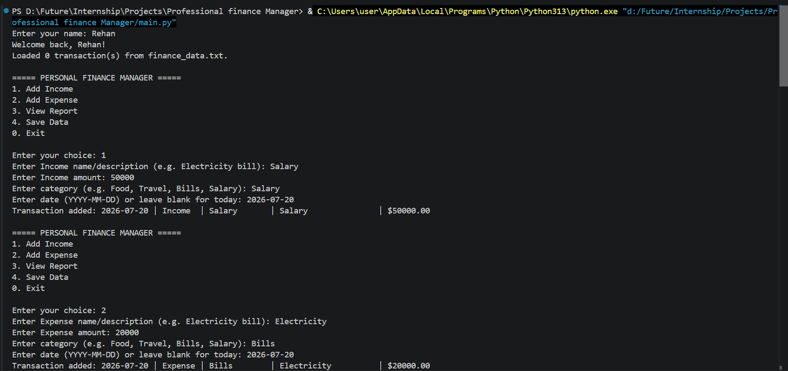
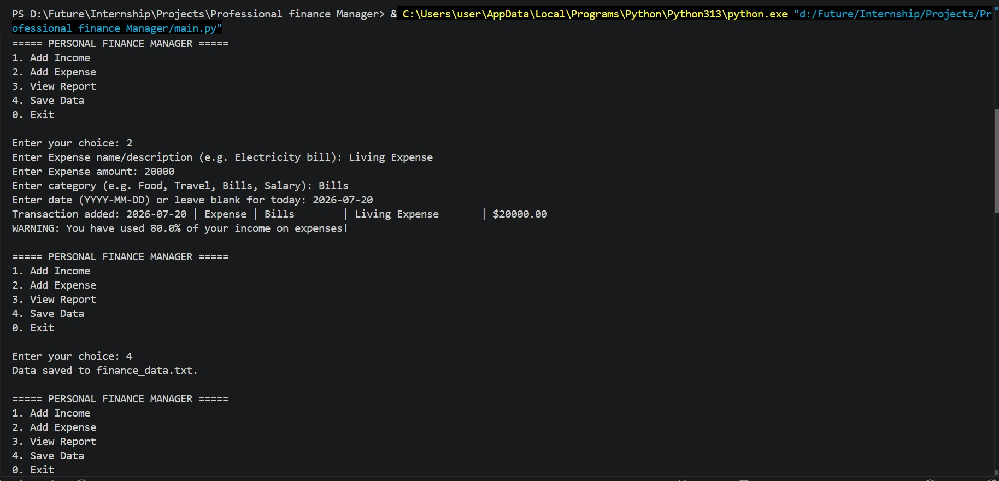
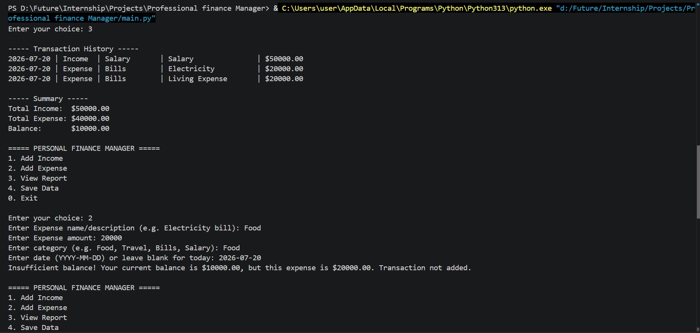
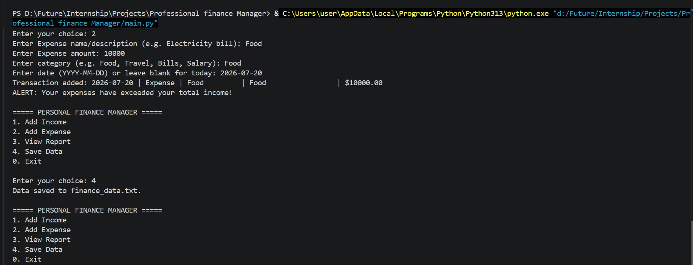
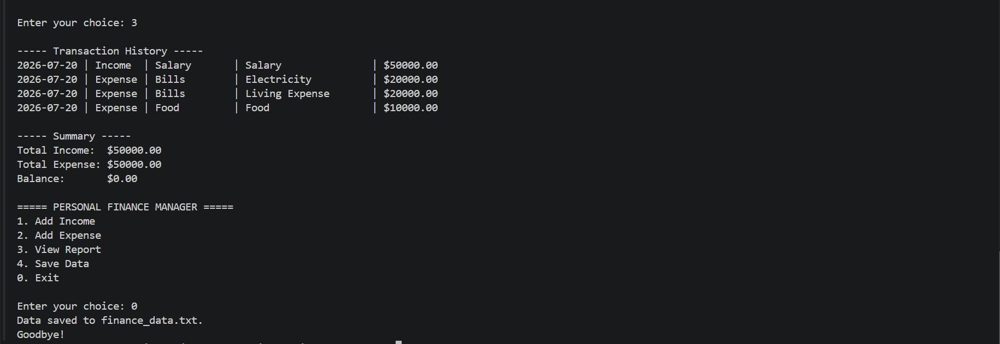

# Personal Finance Manager

A simple Python command-line app for tracking personal income and expenses. It lets you add transactions, view a summary report, and save your data between sessions.

## Demo Video
<video src="https://github.com/user-attachments/assets/23e8ea3d-729a-4508-b35f-3be9489d92e2" controls width="600"></video>

## Screenshots

   1.
   

   2.
   

   3.
   

   4.
   

   5.
   

## Features

- Add income and expense transactions
- Track transaction date, category, name, and amount
- View a transaction history report
- Automatically warn when expenses approach or exceed income
- Save and load data from local text files

## Project Structure

- `main.py` - CLI entry point and menu loop
- `finance_manager.py` - Business logic for transactions, reports, saving, and loading
- `transaction.py` - Transaction model and file serialization helpers
- `user.py` - User model, balance tracking, and totals
- `budget_alert.py` - Expense warning logic
- `finance_data.txt` - Saved transaction history created at runtime
- `user_name.txt` - Saved user name created at runtime

## Requirements

- Python 3.8 or later

The project uses only the Python standard library, so no extra packages are required.

## How to Run

1. Open a terminal in the project folder.
2. Run the app:

```bash
python main.py
```

## Usage

When the app starts, it will:

- Ask for your name the first time and store it in `user_name.txt`
- Load previously saved transactions from `finance_data.txt` if available

Available menu options:

1. Add Income
2. Add Expense
3. View Report
4. Save Data
0. Exit

For each transaction, enter:

- A description or name
- The amount
- A category such as Food, Travel, Bills, or Salary
- An optional date in `YYYY-MM-DD` format

If you leave the date blank, the app uses today's date.

## Data Persistence

The app stores data in plain text files in the project directory:

- `finance_data.txt` keeps all saved transactions
- `user_name.txt` keeps the last entered user name

If these files do not exist yet, the app creates them when needed.

## Notes

- Expenses cannot exceed the current balance.
- A warning appears when expenses use 80% or more of total income.
- If expenses go beyond income, an alert is shown.

## Example

```text
===== PERSONAL FINANCE MANAGER =====
1. Add Income
2. Add Expense
3. View Report
4. Save Data
0. Exit
```

## License

No license has been specified yet.
