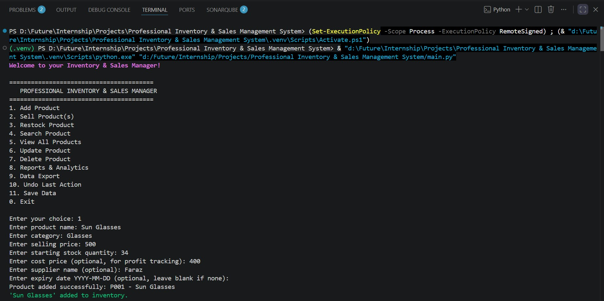
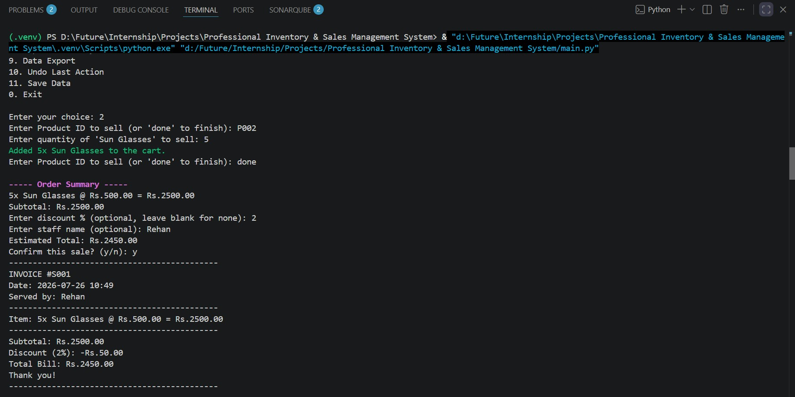
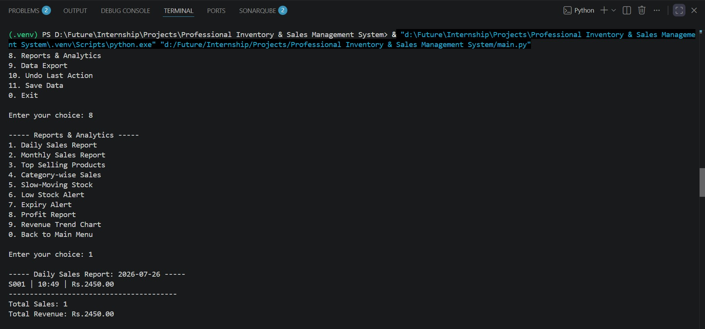
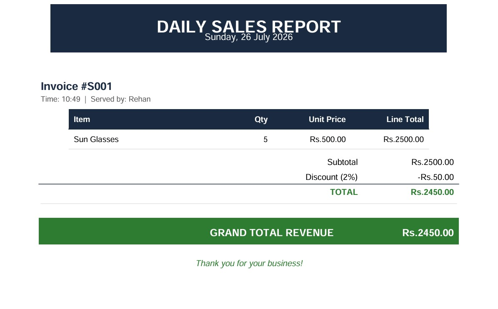

# Professional Inventory & Sales Management System

A Python command-line application for managing products, sales, stock movement, reports, and exports. The project stores inventory and sales data in CSV files, provides interactive menus for day-to-day operations, and can generate Excel, PDF, and chart-based outputs for reporting.

## Demo Video
<video src="https://github.com/user-attachments/assets/26bf097c-49b8-4b87-ad53-829525eef8e9" controls width="600"></video>

## 1
   

## 2
   

## 3
   


## Daily Sales Report PDF
   

## Overview

This system is designed for small retail or stock-tracking workflows where you need to:

- add, update, search, restock, and delete products
- process one or more product sales in a single checkout flow
- track profit using optional cost price data
- monitor low stock and expiry warnings
- review sales analytics through console reports
- export inventory and daily sales reports to external files

The application starts in `main.py`, loads saved data from `products.csv` and `sales.csv`, and runs as an interactive terminal menu until you exit.

## Features

### Inventory Management

- add new products with category, price, stock, supplier, and expiry date
- search products by name or category
- view the full inventory with pagination
- update product details selectively
- delete products with undo support
- restock existing products
- undo the most recent action

### Sales Processing

- create multi-item sales through a simple cart flow
- validate available stock before checkout
- apply optional discounts
- record staff name for each sale
- print a console invoice after confirmation
- restore stock if a sale is undone

### Reporting and Analytics

- daily sales report
- monthly sales report
- top-selling products
- category-wise sales
- slow-moving stock report
- low stock alert
- expiry alert
- profit report
- revenue trend chart saved as an image

### Exporting

- export the current inventory to Excel
- export the day’s sales to a styled PDF report
- generate individual invoice PDFs through the exporter module

## Project Structure

```text
main.py                # Interactive menu and application entry point
inventory_manager.py   # Inventory, sales, persistence, and undo logic
product.py             # Product model and stock/expiry helpers
sale.py                # Sale model, totals, profit, and CSV serialization
report_generator.py    # Console reports and revenue chart generation
exporter.py            # Excel and PDF export helpers
utils.py               # Input validation and colored console output
products.csv           # Saved inventory data
sales.csv              # Saved sales history
```

The repository also includes generated example outputs such as `daily_sales_report.pdf` and `revenue_trend.png`.

## Requirements

The project uses the following third-party packages:

- pandas
- reportlab
- matplotlib
- colorama
- openpyxl

## Installation

1. Clone or open the project folder.
2. Create and activate a virtual environment.
3. Install the dependencies:

```bash
pip install pandas reportlab matplotlib colorama openpyxl
```

If you already have a prepared environment in `.venv`, activate it before running the app.

## Running the Application

From the project root, run:

```bash
python main.py
```

On Windows, you can also use:

```bash
py main.py
```

The application will:

1. load data from `products.csv` and `sales.csv`
2. display the main menu
3. keep running until you choose Exit
4. save data automatically when you exit

## How It Works

### 1. Product Management

When you add a product, the system assigns an ID such as `P001`, `P002`, and so on. Each product can store:

- product name
- category
- selling price
- stock quantity
- cost price for profit tracking
- supplier name
- expiry date in `YYYY-MM-DD` format

### 2. Selling Items

The sale flow lets you enter one or more product IDs, choose quantities, review the subtotal, optionally apply a discount, and confirm the transaction. After confirmation, stock is reduced and the sale is saved with a sale ID such as `S001`.

### 3. Reports

The report menu reads directly from the loaded sales and product data. It can show totals, rankings, alerts, profit summaries, and a daily revenue chart. The chart is saved to `revenue_trend.png` by default.

### 4. Exporting

- Inventory export writes the current product list to `inventory_export.xlsx`.
- Daily sales export creates a styled PDF report called `daily_sales_report.pdf`.
- Invoice export support is also available from `exporter.py`.

## Data Files

### products.csv

Stores the current inventory. The expected columns are:

- product_id
- name
- category
- price
- quantity_in_stock
- cost_price
- supplier
- expiry_date

### sales.csv

Stores sale history in a row-per-item format. The expected columns are:

- sale_id
- date_time
- product_id
- name
- quantity
- price
- cost_price
- staff_name
- discount_percent

## Notes and Behavior

- The app auto-loads existing CSV data at startup.
- The app saves data when you choose Save Data or Exit.
- Undo is in-memory for the current session and depends on the undo stack.
- Expiry checks only work when a valid date is entered in `YYYY-MM-DD` format.
- Low stock alerts trigger when stock drops below 5 units.
- Expiry warnings trigger when a product expires within 7 days.

## Generated Outputs

Depending on the actions you use, the project may generate the following files:

- `inventory_export.xlsx`
- `daily_sales_report.pdf`
- `invoice_<sale_id>.pdf`
- `revenue_trend.png`

These are safe to regenerate and can be removed if you want a clean workspace.

## Troubleshooting

### The app cannot read or write CSV files

Make sure you run the program from the project root so it can find `products.csv` and `sales.csv`.

### Excel export fails

Install `openpyxl`, since pandas uses it for writing `.xlsx` files.

### PDF export fails

Check that `reportlab` is installed and that the target PDF file is not open in another program.

### Revenue chart is not created

The chart can only be generated after sales data exists.

## Suggested Workflow

1. Add your products.
2. Record sales as they happen.
3. Review reports regularly for stock and profit visibility.
4. Export Excel or PDF reports when you need to share data.
5. Save data before closing if you want to preserve the current session state.

## License

No license file is included in the repository. Add one if you want to define reuse or distribution terms.
