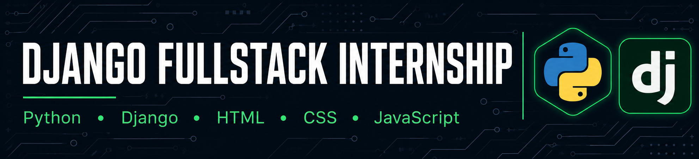

<div align="center">

<!-- 🖼️ BANNER IMAGE GOES HERE — see notes at the bottom of this file for what to use -->


# 🚀 Django Fullstack Internship

### A collection of HTML, CSS, Python & Django projects built during my learning journey

[](https://internship-axskzl99q-rehan-web.vercel.app)


</div>

---

## 📌 About

This repository is a growing collection of projects I built while learning **Python, HTML, CSS, and Django**. Each folder is a self-contained project with its own code and README. New projects are added regularly as I continue building.

**🔗 Live Portfolio :** [Rehan's Portfolio](https://internship-axskzl99q-rehan-web.vercel.app)

---

## 📂 Projects

> Click a project name to open its folder and see the code.

| # | Project | Description | Tech |
|---|---------|--------------|------|
| 01 | [1_Portfolio](./1_Portfolio) | My personal portfolio website — live demo linked above. | HTML, CSS, JS |
| 02 | [BMI Calculator](./BMI%20Calculator) | Calculates Body Mass Index from height and weight input, with category classification. | Python |
| 03 | [Band Name Generator](./Band%20Name%20Generator) | Generates a random band name using city and pet name inputs. | Python |
| 04 | [Black-jack-Casino-Simulator](./Black-jack-Casino-Simulator) | Console-based Blackjack game simulating dealer/player logic and card values. | Python |
| 05 | [Caesar Cipher](./Caesar%20Cipher) | Encrypts/decrypts text using the classic Caesar Cipher shifting technique. | Python |
| 06 | [Calculator](./Calculator) | A basic arithmetic calculator supporting chained operations. | Python |
| 07 | [Combat Warrior](./Combat%20Warrior) | A turn-based text combat game with health, attack, and win/lose logic. | Python |
| 08 | [Hangman](./Hangman) | Classic word-guessing game with lives and ASCII art stages. | Python |
| 09 | [Higher Lower Game](./Higher%20Lower%20Game) | Compares two items and asks the user to guess which has the higher value. | Python |
| 10 | [Password Generator](./Password%20Generator) | Generates strong, randomized passwords based on user-defined criteria. | Python |
| 11 | [Rock, Paper, Scissors](./Rock%2C%20Paper%2C%20Scissors) | Classic Rock/Paper/Scissors game against the computer. | Python |
| 12 | [Scope and Number-Guessing Game](./Scope%20and%20Number-Guessing%20Game) | A number-guessing game demonstrating variable scope concepts. | Python |
| 13 | [Secret Auction Program](./Secret%20Auction%20Program) | A blind auction simulator that tracks and reveals the highest bidder. | Python |
| 14 | [Tip Calculator](./Tip%20Calculator) | Calculates per-person bill split including tip percentage. | Python |
| 15 | [Treasure Island](./Treasue%20Island) | A text-based choose-your-own-adventure game with branching paths. | Python |
| 16 | [Coffee Machine](./Coffee%20Machine) | Coffee machine simulator that serves drinks, tracks resources, and handles coin payments with change calculation that is generated only by loops. | Python |
| 17 | [Coffee Machine](./Coffee%20Machine%20(OOP)) | Coffee vending machine built with Python OOP that manages drink orders, resources, and coin payments.. | Python |


<!-- 👇 Add new rows here as you upload more projects. Use the same format:
| 16 | [New Project Name](./New-Project-Folder) | Short one-line description. | Python |
-->

---

## 🧰 Tech Stack

<div align="center">


</div>

---

## 📁 Repository Structure

```
Django-Fullstack-Internship/
│
├── 1_Portfolio/
├── BMI Calculator/
├── Band Name Generator/
├── Black-jack-Casino-Simulator/
├── Caesar Cipher/
├── Calculator/
├── Combat Warrior/
├── Hangman/
├── Higher Lower Game/
├── Password Generator/
├── Rock, Paper, Scissors/
├── Scope and Number-Guessing Game/
├── Secret Auction Program/
├── Tip Calculator/
├── Treasue Island/
│
├── assets/
│   └── banner.png        ← README banner image (see notes below)
│
└── README.md              ← (this file)
```

Each project folder contains its own `main.py` (or equivalent) and a short local `README.md` describing that specific project.

---

## ➕ How I Add New Projects

1. Create a new folder in the repo root, named after the project (e.g. `Quiz App`).
2. Add the project's code files inside that folder.
3. Add a short `README.md` inside that folder describing what it does.
4. Come back to **this** README and add one new row to the **Projects** table above, following the same format as the existing rows.
5. Commit and push — done.

---

## 📫 Connect With Me

<div align="center">

[](https://linkedin.com/in/muhammad-rehan-masood-48126241b)
[](https://github.com/Rehan-Masood)
[](https://internship-axskzl99q-rehan-web.vercel.app)

</div>

---

<div align="center">

**Made with ❤️ by Muhammad Rehan Masood**

</div>
