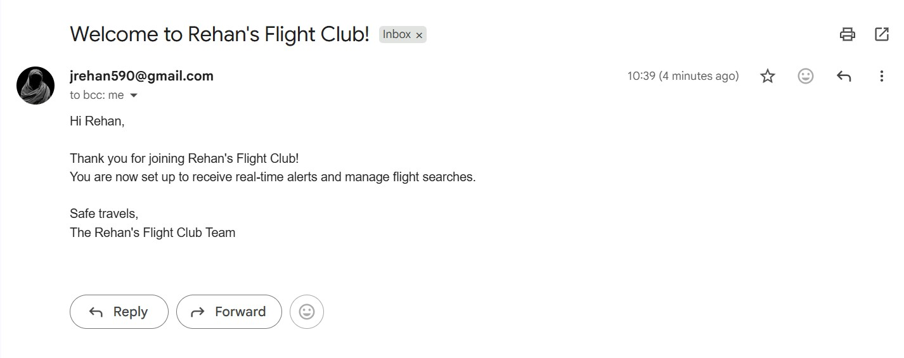
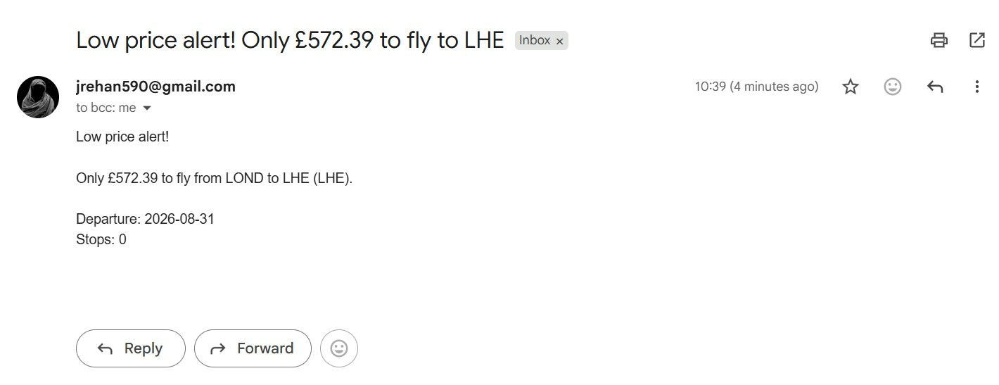
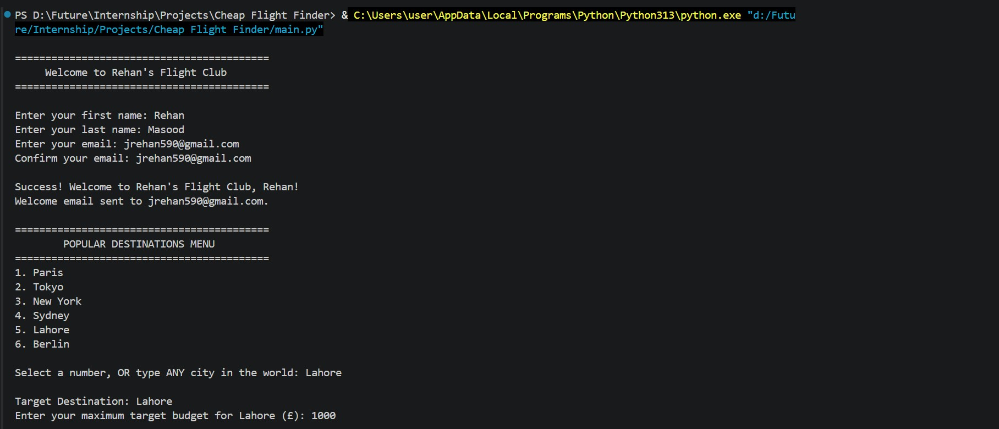
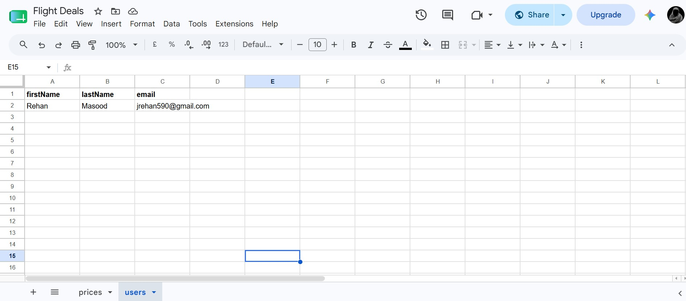
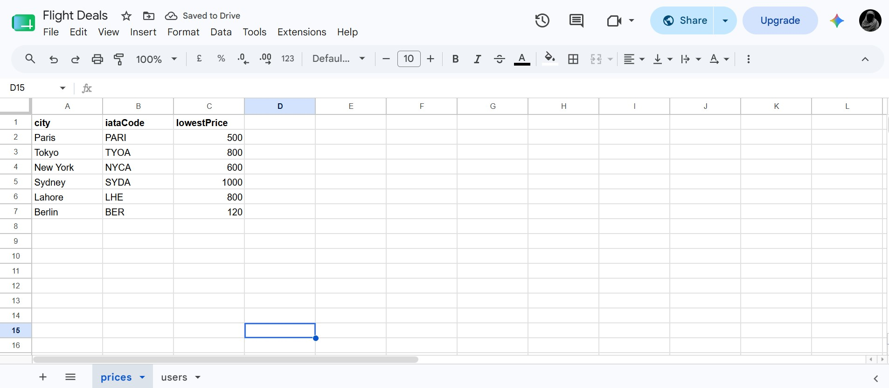

# Cheap Flight Finder

Cheap Flight Finder is a Python command-line app that helps you discover and evaluate flight deals from London to a destination of your choice. It combines a simple sign-up flow, live flight search, budget comparison, and email notifications.

## Demo Video
<video src="https://github.com/user-attachments/assets/fd10dbb6-f13d-4f41-bbf4-e6a0be15b1df" controls width="600"></video>

## Welcome-Email
   

## Reservation-Email
   

## Output
   
   

## Users-Detail
   

## Prices-Detail
   

## What the app does

The program:
- welcomes the user and collects their name and email address,
- lets the user choose a destination from a list or enter any city,
- looks up the airport location data for the chosen destination,
- searches for a live flight deal from London for a date about 30 days from now,
- compares the result against the user’s budget,
- offers a booking link and can send a deal email notification.

## Features

- Interactive sign-up flow for subscribers
- Destination selection from popular cities or custom input
- Live flight lookup using the Sky Scrapper API on RapidAPI
- Budget-based deal evaluation with a simple yes/no booking prompt
- Welcome email and flight deal email notifications via Gmail SMTP
- User and subscriber data storage through Sheety

## Project files

- main.py – runs the full app flow
- signup.py – handles the sign-up and welcome email process
- flight_search.py – performs airport lookup and flight searches
- user_manager.py – stores new subscribers in Sheety
- notification_manager.py – sends notification emails
- data_manager.py – manages destination-related data
- flight_data.py – structures flight search results
- credentials_example.py – example configuration template
- credentials.py – your private credentials file

## Requirements

Install the required package:

```bash
pip install requests
```

## Setup

1. Copy the example credentials file:

```bash
copy credentials_example.py credentials.py
```

2. Fill in the values in credentials.py:
- Sheety endpoints and authentication details
- RapidAPI key
- your email address and Gmail app password

3. Make sure your Sheety data source is configured correctly for the app to use.

## How to run

Run the app from the project folder:

```bash
python main.py
```

The app will then:
- prompt you to sign up,
- ask you to choose a destination,
- ask for your budget,
- search for a flight deal,
- show the best available option and offer a booking link.

## Notes

- The flight search uses the Sky Scrapper API, and the app includes fallback behavior if the API is rate-limited or unavailable.
- Gmail requires an app-specific password if you are using Gmail with SMTP.
- Keep your credentials private and do not share the contents of credentials.py.
