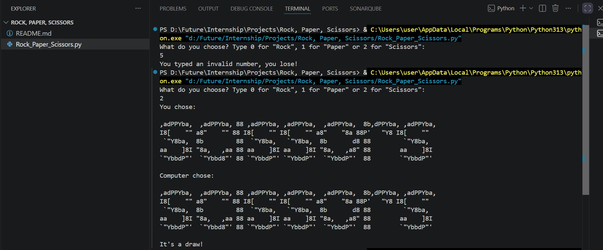
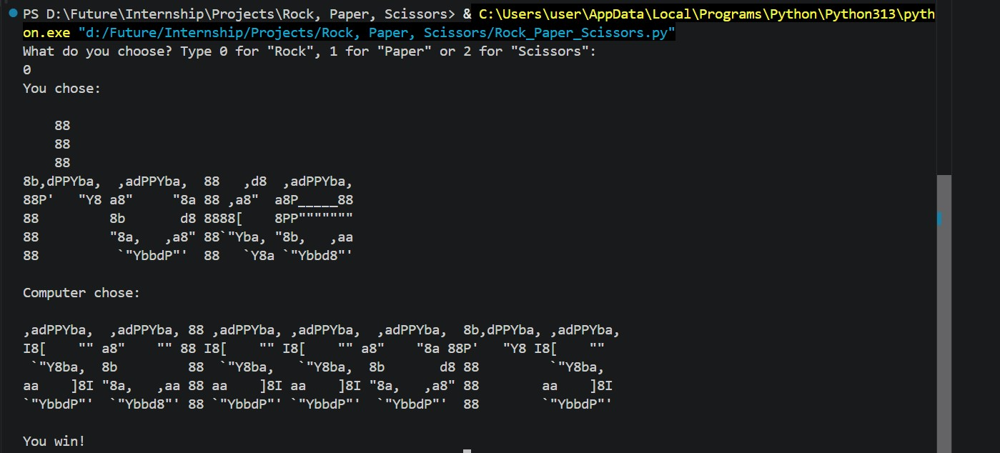

# Rock, Paper, Scissors Game

A simple, interactive terminal-based Rock, Paper, Scissors game implemented in Python. The game features stylized ASCII art for each choice and plays against a computer opponent.

# Screenshot
1.


2.


## Table of Contents
- [Features](#features)
- [How to Play](#how-to-play)
- [Requirements](#requirements)
- [Installation & Running](#installation--running)
- [Game Logic](#game-logic)

## Features
- **ASCII Art:** Custom ASCII text art representing Rock, Paper, and Scissors for a visually engaging terminal interface.
- **Randomized Opponent:** The computer opponent randomly selects its move using Python's built-in `random` module.
- **Input Validation:** Simple checks to handle invalid user inputs gracefully.

## How to Play
1. Launch the game from your terminal.
2. When prompted, type a number representing your move:
   - `0` for **Rock**
   - `1` for **Paper**
   - `2` for **Scissors**
3. The computer will make its choice.
4. The winner is determined based on classic Rock, Paper, Scissors rules:
   - Rock beats Scissors.
   - Scissors beats Paper.
   - Paper beats Rock.
   - Equal choices result in a Draw.

## Requirements
- Python 3.x

## Installation & Running

1. Clone or navigate to the project directory:
   ```bash
   cd "d:/Future/Internship/Projects/Rock, Paper, Scissors"
   ```

2. Run the script using Python:
   ```bash
   python Rock_Paper_Scissors.py
   ```

## Game Logic
The core flow of [Rock_Paper_Scissors.py](file:///d:/Future/Internship/Projects/Rock,%20Paper,%20Scissors/Rock_Paper_Scissors.py) is as follows:
- **User input selection:** Prompts user for an integer choice (0, 1, or 2).
- **Validation:** If the choice is outside the range 0-2, the program outputs an error and the user loses.
- **Computer choice selection:** Generates a random integer between 0 and 2.
- **Outcome evaluation:** Compares choices to output `You win!`, `You lose!`, or `It's a draw!`.
