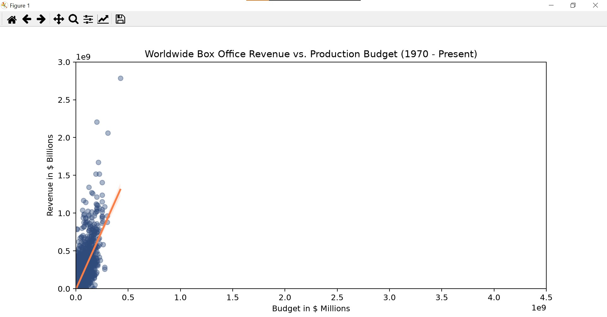

# Seaborn Linear Regression

This project explores the relationship between movie production budgets and worldwide box office revenue using Python, Seaborn, and scikit-learn.

## Demo Video
<video src="https://github.com/user-attachments/assets/10a53fad-50ac-4dbf-8bde-87405bc466f1" controls width="600"></video>

## Seaborn Linear Regression
   

## Project Overview

The script:
- loads a movie dataset from a CSV file,
- cleans and converts the financial columns into numeric values,
- visualizes the relationship with a Seaborn regression plot,
- fits a linear regression model using scikit-learn,
- prints the model statistics and a revenue prediction for a sample budget.

## Files

- `main.py` — main Python script that performs data cleaning, visualization, and regression analysis.
- `cost_revenue_dirty.csv` — input dataset containing movie budget and revenue information.
- `requirements.txt` — Python dependencies required to run the project.
- `Seaborn_and_Linear_Regression_(complete).ipynb` — notebook version of the same analysis.

## Requirements

Install the required dependencies:

```bash
pip install -r requirements.txt
```

## How to Run

Run the script with:

```bash
python main.py
```

This will:
1. load the dataset,
2. display a regression plot,
3. print the regression model results and a sample prediction.

## Technologies Used

- Python
- pandas
- matplotlib
- seaborn
- scikit-learn

## Notes

The analysis focuses on movies released from 1970 onward and uses worldwide gross revenue as the target variable for the regression model.
