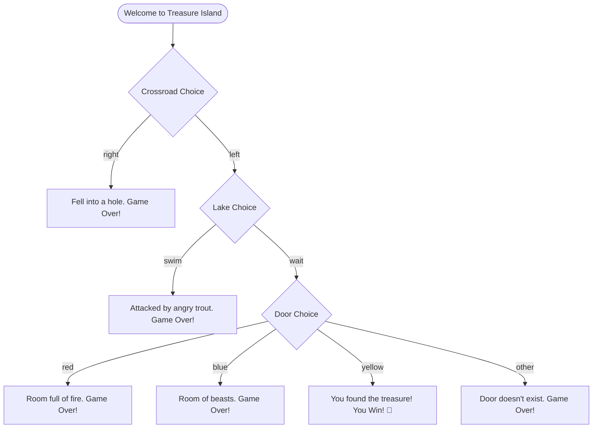

# 🏴‍☠️ Treasure Island Adventure Game

Welcome to **Treasure Island**, a classic text-based interactive adventure game written in Python! 

Your mission, should you choose to accept it, is to navigate a series of dangerous choices, avoid deadly traps, and find the hidden treasure.

---

## 🎮 How to Play

The game will prompt you to make decisions at key moments. Type your choices in the terminal when prompted and press **Enter**.

### The Flow of Choices
1. **The Crossroads**: Choose between going `left` or `right`.
2. **The Lake**: Choose to `wait` for a boat or `swim` across.
3. **The Island House**: Choose between three doors: `red`, `yellow`, or `blue`.

Choose wisely—one wrong move, and the game is over!

---

## 🚀 Getting Started

### Prerequisites
You need **Python 3** installed on your system to run the game. You can check your version using:
```bash
python --version
```

### Running the Game
Navigate to the project directory and run the script:
```bash
python Treasure_Island.py
```

---

## 📝 Game Logic & Rules (Spoiler Alert! ⚠️)

If you are struggling to find the treasure, here is a hint of the game's branching logic:



---

## 🛠️ Code Overview

The game is built entirely in Python using simple conditional structures (`if-elif-else`) and standard input/output. It is a great starting project for beginners learning control flow in Python.

- **File**: `Treasure_Island.py`
- **Language**: Python 3.x
- **Key Concepts**: Input handling, lowercasing strings for robust comparison, nested conditional statements.
